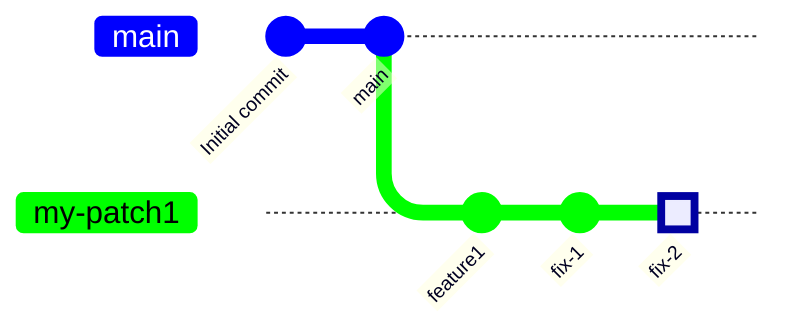
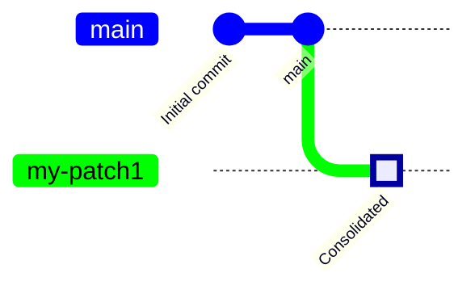

# Rebase Demo

A demonstration of using rebase to base commits on a different branch.

----
<style>
    .mine code {
        background-color: #80ff80;
        color: #000000;
    }
    .theirs code {
        background-color: #ff0000;
        color: #000000;
    }
    .main code {
        background-color: #0000ff;
        color: #ffffff
    }
    .old code {
        background-color: #808080;
        color: #ffffff
    }
    .another code {
        background-color: #ffc000;
        color: #000000;
    }
</style>

> Ignore the HTML above if you see it.
----
> This repository is best viewed in Visual Studio code with the following
> plugins enabled:

* [Markdown Preview Enhanced](https://marketplace.visualstudio.com/items?itemName=shd101wyy.markdown-preview-enhanced)
* [Mermaid Preview](https://marketplace.visualstudio.com/items?itemName=vstirbu.vscode-mermaid-preview)

> To get started:

* Open the README.md file
* Use the _Markdown: Open Preview to the Side_ command, or click this icon at
the top of the window:

* You may then close the README.md buffer.

>NOTE: This demo uses <span class='main'>`main`</span> for the main branch. Older repositories often use <span class='main'>`master`</span>.

----

* <span class='main'>`main`</span>
* <span class='theirs'>`feature1`</span>
* <span class='mine'>`my-patch1`</span>

<blockquote>
Note: <span class='main'><code>main</code></span> may be called
<span class='main'><code>master</code></span> in older repositories.
</blockquote>

## Try it

This repository has this scenario set up for you to try.

The line below is what changes between branches:

You are on branch: <span class='mine'>`my-patch1`</span>, commit "fix-2"

You can use the GitLens commit graph to view the results, or you can use
this command:

```bash
git log --graph --all
```

## Scenario

In this scenario, you have added a set of commits
on top of main. Your goal is to collapse them into a
single commit, with a new commit message.

This is the starting state:



The goal is a single commit on <span class='mine'>`my-patch1`</span>, with a
commit message of `Consolidated`.



To do this, we will do an interactive rebase:

`git rebase --interactive main`
or
`git rebase -i main`

This will bring up an editor with the following lines:

```text
pick 2781cec main
pick 1ad4df4 feature1
pick 18c87da fix-1
pick 9234649 fix-2
```

(There will also be blank and comment lines; we can ignore these).

These lines form a script that rewrites the current branch, going back to where branch <span class='main'>`main`</span> and branch <span class='ours'>`my-patch1`</span> diverge.

We want to collapse `fix-1` and `fix-2` into them`feature1` commit, and give it a new message.

To do this, we replace `pick` with `squash` on those two commits, like this:

```text
pick 2781cec main
pick 1ad4df4 feature1
squash 18c87da fix-1
squash 8675c09 fix-2
```

We save the file and exit the editor. Git will then proceed to execute the script.

It will then bring up a text editor to supply the commit message.

```text
# This is a combination of 3 commits.
# This is the 1st commit message:

feature1

# This is the commit message #2:

fix-1

# This is the commit message #3:

fix-2
```

Once again, we can ignore comments. Replace the text above with the new message.

```text
3 consolidated commits
```

Save the editor buffer and exit the editor.

You may need to do:

```bash
git rebase --continue
```

If you run into problems, you can go back wt this:

```bash
git rebase --abort
```

This would be a good time to do:

```bash
git pull -r origin main
git push origin main
```
