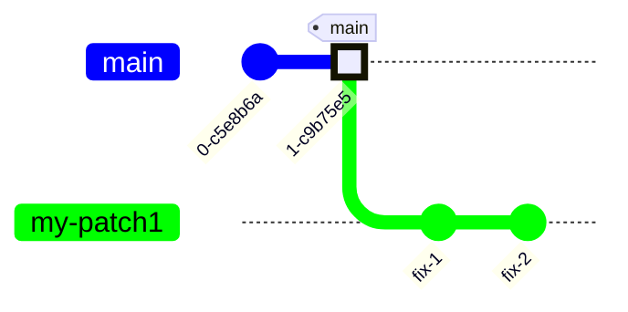
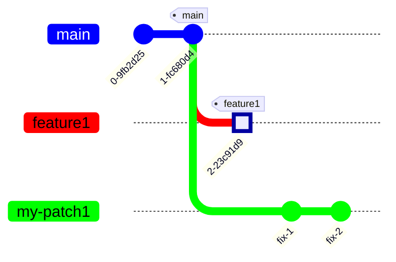

# Rebase Demo

A demonstration of using rebase to base commits on a different branch.

----
<style>
    .mine code {
        background-color: #80ff80;
        color: #000000;
    }
    .theirs code {
        background-color: #ff0000;
        color: #000000;
    }
    .main code {
        background-color: #0000ff;
        color: #ffffff
    }
    .old code {
        background-color: #808080;
        color: #ffffff
    }
    .another code {
        background-color: #ffc000;
        color: #000000;
    }
</style>

> Ignore the HTML above if you see it.
----
> This repository is best viewed in Visual Studio code with the following
> plugins enabled:

* [Markdown Preview Enhanced](https://marketplace.visualstudio.com/items?itemName=shd101wyy.markdown-preview-enhanced)
* [Mermaid Preview](https://marketplace.visualstudio.com/items?itemName=vstirbu.vscode-mermaid-preview)

> To get started:

* Open the README.md file
* Use the _Markdown: Open Preview to the Side_ command, or click this icon at
the top of the window:

* You may then close the README.md buffer.

----

* <span class='main'>`main`</span>
* <span class='theirs'>`feature1`</span>
* <span class='mine'>`my-patch1`</span>

<blockquote>
Note: <span class='main'><code>main</code></span> may be called
<span class='main'><code>master</code></span> in older repositories.
</blockquote>

## Try it

This repository has this scenario set up for you to try.

The line below is what changes between branches:

You are on branch: <span class='mine'>`my-patch1`</span>, commit "fix-1"

Use `git switch`<code>_branch_</code> to switch to each of these branches, then
switch to <span class='mine'>`my-patch`</span> to try out the fix.

You can use the GitLens commit graph to view the results, or you can use
this command:

```bash
git log --graph --all
```

## Scenario

Let's say you are creating a patch, so you start a branch. Let's call it <span class='mine'>`my-patch1`</span>.

This is what you intend:



But let's say you forgot you were working on another branch, <span class='theirs'>`feature1`</span>,
and do this instead:


You want to fix it like this:



That is, you want to leave <span class='theirs'>`feature1`</span> alone
and not include it in your pull request.

## The fix: `git rebase --onto`

To fix this, we need to tell git three things:

1. Where we want to put our commits. Here, that's
<span class='main'>`main`</span>
2. The patch before the range we want to move. Here,
that's the <span class='theirs'>`feature1`</span> branch.
3. The branch we want to move. Here, that's our
<span class='mine'>`my-patch1`</span> branch

To do this, we use `git rebase --onto`:

```bash
git rebase --onto main feature1 my-patch1
```

## The result


The result is that your fixes are copied into a new chain of commits
starting with the current <span class='main'>`main`</span> commit.

## The Pull Request

One mistake that git is not very forgiving of is changing history
that you've already shared with others via `git push`.

### The easy case

If you haven't pushed your branch yet, you're all set.
You can safely push <span class='mine'>`my-patch`</span> and make your pull request.

```bash
git push --set-upstream origin my-patch
```

If not, you have two choices.

### The safe option

The problem is that it can cause difficulties and
confusion for others who have already cloned your branch.

To avoid this you can delete your pull request, if any, and then rename
your branch, e.g. <span class='mine'>`my-patch-1`</span>:

```bash
git branch -M my-patch my-patch-1
git push --set-upstream origin my-patch-1
```

Then make a new pull request.

### The quick option

If nobody is using what you've pushed, you can do a
_force push_ to update your branch. Normally, you can
only add commits to branches when you push. But with
the `--force-with-lease` option you can tell the server
to simply set <span class='mine'>`my-patch`</span> to point to the new commit:

```bash
git push --set-upstream --force-with-lease origin my-patch
```

`--force-with-lease` is a newer, safer version of
`--force` that avoids certain race conditions. It's good
to get in the habit of using it instead of `--force`.

## If you make a mistake

The old commits remain in the repository. They are no longer
referenced by your branch. They might be referenced by
<span class='another'>`another-branch`</span> like this:


But that's unlikely in this scenario.

You can also find the commit ID in the reflog and construct such a
branch later if you need to recover. Git is very forgiving of most mistakes.

If nothing references your old branch, git will eventually
garbage collect those commits when pruning the reflog:
(default: >90 days).

To find past commits, the first place to look is on the remote branches.

```bash
git branch -v --all
```

Doing `git log` on these may identify which commit you need (often it is the
tip of the corresponding remote branch itself).

To find past commits that are no longer on any branch `git reflog` will list
every commit that a branch has pointed to, for at least the past 90 days.

Once you have identified the particular commit a branch should point to,
e.g. `a03925f`, you can do:p

```bash
git switch my-branch1
git reset --hard a03925f
```

This will move the branch to the indicated commit ID (`a03925f`) and update
the working tree to match.

Another convenient trick is to create a branch to remember a particular commit
you want to investigate.

```bash
git switch -C temp a03925f
```

## More

`git rebase` can do much more, including reordering history, but this is
the most common usage.
